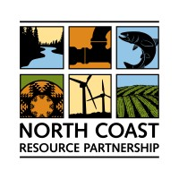

# Projects

Vinny is the creator and maintainer of several open-source software packages for data science and machine learning.

---

## Featured Projects

::::{grid} 2 2 4 4

:::{card}
:link: https://healthyeldorado.org/

+++
**HELP**
:::

:::{card}
:link: https://wildfiretaskforce.org/

+++
**CWFRTF**
:::

:::{card}
:link: https://northcoastresourcepartnership.org

+++
**NCRP**
:::

:::{card}
:link: https://forestbusinessalliance.org/

+++
**Forest Business Alliance**
:::

::::

---

## Projects

::::{grid} 1 2 3 3

:::{card} project-alpha
:link: https://github.com/username/project-alpha
A Python package for data analysis and visualization
:::

:::{card} project-beta
:link: https://github.com/username/project-beta
Machine learning utilities for scientific computing
:::

:::{card} project-gamma
:link: https://github.com/username/project-gamma
Cloud computing tools for large-scale data processing
:::

::::

---
